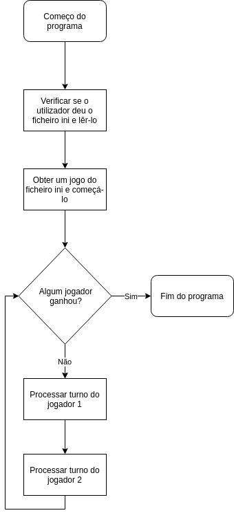

# Settlers of Catan project

# Autores
- Afonso Teixeira a21803282
- Ana Rita a21803275

## Solução
O programa foi estruturado por separar o projeto em 5 partes essenciais:
- Ficheiro
- IO
- Jogo
- Leitor_ini
- Main

Cada um destes têm uma parte essencial no projeto, Ficheiro é uma maneira de ler um ficheiro para memoria de uma maneira a poder iterar sobre linhas invês de só sobre cada caracter. IO server como uma maneira de falar com o utilizador, perguntar sim our não, ou perguntar um numero. Jogo serve para organizar tudo sobre o jogo em si, inclui funções para processar um turno, ou imprimir o estado do jogo, etc. Leitor_ini é uma maneira de ler o ficheiro .ini contendo o jogo e retornar um jogo, utiliza Ficheiro e Jogo. Main é a parte principal do programa, é a parte que utiliza as outro 4 partes para correr o jogo.

### Fluxograma

## Estrutura de dados

O jogo todo está dentro de uma `struct`, que têm tudo necessário para o jogo como a grelha de simulação, as duas dimensões e os 2 jogadores.

A gralha de simulação é um vetor de tipo `Cela`, e que é usado sabendo o seu tamanho pelas variaveis `xdim` e `ydim`.

Cada jogador tambêm é uma `struct`, e tem um array de tamanho 5, com as cartas e o numero de pontos

Cada cela é uma `struct` que tem 4 recursos naturais, im proprietário e o tipo de cela (Nada, Aldeia e Cidade).

Cada recurso natural é tambem uma `struct`, representado por um tipo de recurso e um valor, ou seja quanto do recurso existe

## Algoritmos relevantes

Enquanto a fazer o jogador, utilizamos uma propriedade de arrays e de enums, o enum que representa um recurso natural vai de 0 a 5, 5 sendo o deserto, por isso, se temos um array de tamanho 5, assim podendo utilizar os valores de enum para aceder ás cartas.

# Manual de utilizador

## Como compilar

Para compilar, basta abrir um terminal do diretório do projeto e executar `make`, isto irá usar o compilador de C para construir o projeto todo dentro da pasta bin/.

Para jogar basta executar o programa dando exatamente 1 ficheiro ini para construir o jogo de.

Exemplo: `./main map.ini`

## Como jogar

O jogo é um turn based jogado numa grid de celas numa luta por recursos, em que dois jogadores constrõem aldeias e cidades para obter mais recursos para ganhar o jogo.

Cada turno o jogador rola dois dados, se a soma for igual ao numero de recursos de qualquer das suas aldeias or cidades, ele recebe uma carta desse recurso (2 se for uma cidade).

No mesmo turno o jogador pode obtar por comprar uma aldeia adjacente a qualquer das suas aldeias ou cidades por B1 L1 G1 e W1, transformar qualquer das suas aldeias em cidades por G2 e I3, trocar recursos por recursos com o banco a um rácio de 4:1, ou trocar recursos por pontos a um rácio de 10:1.

Por cada aldeia que o jogador controla, ele ganha 1 ponto, e por cada cidade, 2. O objétivo do jogo é chegar a 6 pontos.

# Referências

[CPP Reference](https://en.cppreference.com/w/c) foi utilizado maioritariamente, mesmo sendo primáriamente uma referencia de C++, inclui muitas referencias de C, que foram usadas para concluir o projeto.

[Stack Overflow](https://stackoverflow.com/) tambem foi utilizado, visto que existem muitas perguntas cujas respostas ajudaram muito no percurso no projeto.

[Este site](http://sekrit.de/webdocs/c/beginners-guide-away-from-scanf.html) tambêm foi usado para perceber como receber input to utilizador sem erros.

